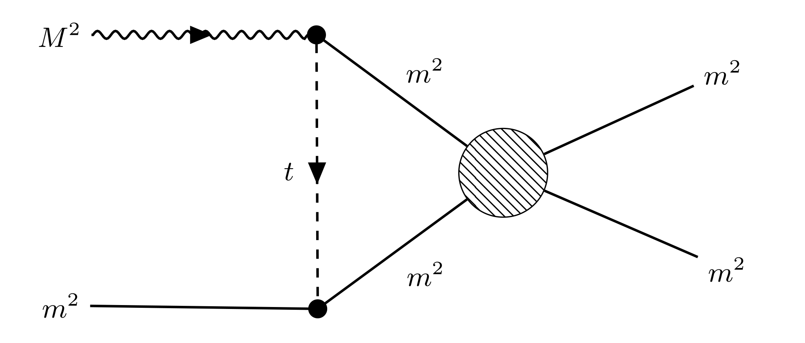

# kt_triangle

Code for investigating properties of triangle diagrams using dispersive techniques in the context of Khuri-Treiman (see for example [[1]](https://arxiv.org/abs/1910.03107)).

<p align="center">
  
</p>
The goal is the evaluation of the diagram above with arbitrary external spin-<em>J</em> of the decaying particle, spin-projection-<em>j</em> in the s-channel and exchanged particle of spin-<em>j'</em> in the t-channel (as well as arbitrary helicity projections <em>λ</em> and <em>λ'</em>).

## EXECUTABLES
Requires ROOT (tested with version 6.17).

To build any example codes in the /executable/ directly, for example `test.cpp`, use:
```
mkdir build
cd build
cmake ..
make test
````

## REFERENCES
* [1] "Khuri-Treiman equations for 3π decays of particles with spin" JPAC Collaboration [[arXiv:1910.03107]](https://arxiv.org/abs/1910.03107)
